# Motion Deblurring — Projet IM01, Télécom Paris

<p align="center">
  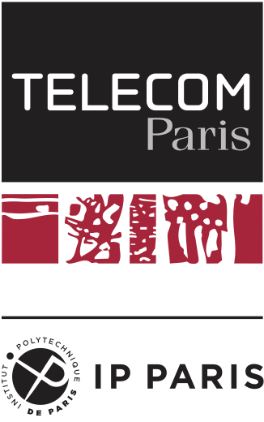
</p>

Ce projet explore la restauration d'images dégradées par un **flou de bougé** (*motion blur*). L'estimation du noyau de flou et la déconvolution TV ont été **entièrement implémentées à la main en Python**, sans recourir à des bibliothèques de restauration d'image. Le projet inclut également une comparaison avec des modèles de deep learning de l'état de l'art.

---

## Table des matières

1. [Contexte et problème](#1-contexte-et-problème)
2. [Pipeline classique](#2-pipeline-classique)
   - [Estimation du noyau (Goldstein & Fattal)](#21-estimation-du-noyau--goldstein--fattal-2012)
   - [Déconvolution TV (Split-Bregman)](#22-déconvolution-tv--split-bregman)
3. [Comparaison deep learning](#3-comparaison-deep-learning)
4. [Résultats & Illustrations](#4-résultats--illustrations)
5. [Structure du dépôt](#5-structure-du-dépôt)
6. [Installation & Usage](#6-installation--usage)
7. [Références](#7-références)

---

## 1. Contexte et problème

Le **flou de bougé** apparaît lorsque la caméra ou le sujet se déplace pendant l'exposition. L'image observée $v$ est modélisée comme :

$$v = u \ast h + n$$

où $u$ est l'image nette inconnue, $h$ le noyau de flou (*PSF*) inconnu, et $n$ un bruit gaussien. L'objectif est de retrouver $u$ et $h$ à partir de $v$ seulement — c'est le problème de **déconvolution aveugle**.

<p align="center">
  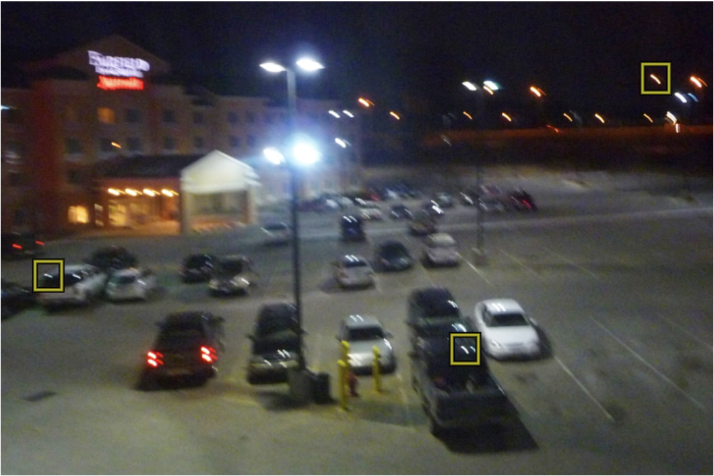
  <br><em>Exemple : image nette, image floutée et noyau de bougé utilisé.</em>
</p>

---

## 2. Pipeline classique

L'intégralité du pipeline — estimation du noyau et déconvolution — a été **implémentée from scratch en Python** à partir des articles de référence, sans utiliser de bibliothèques de restauration d'image. Seules les primitives NumPy/SciPy (FFT, convolution, algèbre linéaire) sont utilisées.

### 2.1 Estimation du noyau — Goldstein & Fattal (2012)

La méthode est fondée sur l'observation que le **spectre de puissance du gradient** d'une image floutée contient une signature caractéristique du noyau de bougé. Toutes les briques algorithmiques (projections shear, autocorrélations, phase retrieval, raffinement itératif) ont été codées à la main.

**Étapes principales :**

1. **Calcul des autocorrélations de projections** — on projette les gradients de l'image sur un ensemble dense d'angles $\theta \in [-\pi/2, \pi/2]$ par une projection de type *shear*, puis on calcule les autocorrélations 1D de chaque projection.

2. **Déconvolution du flou intrinsèque** — les autocorrélations sont légèrement déconvoluées pour supprimer le flou naturel de l'image.

3. **Estimation du support initial** — à partir des minima des autocorrélations, on estime la taille du noyau par direction.

4. **Reconstruction par Phase Retrieval** — le spectre de puissance du noyau est reconstruit, puis la phase est retrouvée par un algorithme itératif de *phase retrieval* (Fienup/HIO).

5. **Raffinement itératif** — le noyau estimé est utilisé pour re-estimer les supports, et l'opération est répétée 3 fois.

<p align="center">
  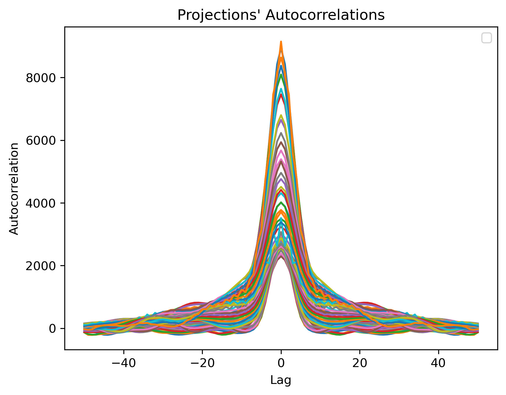
  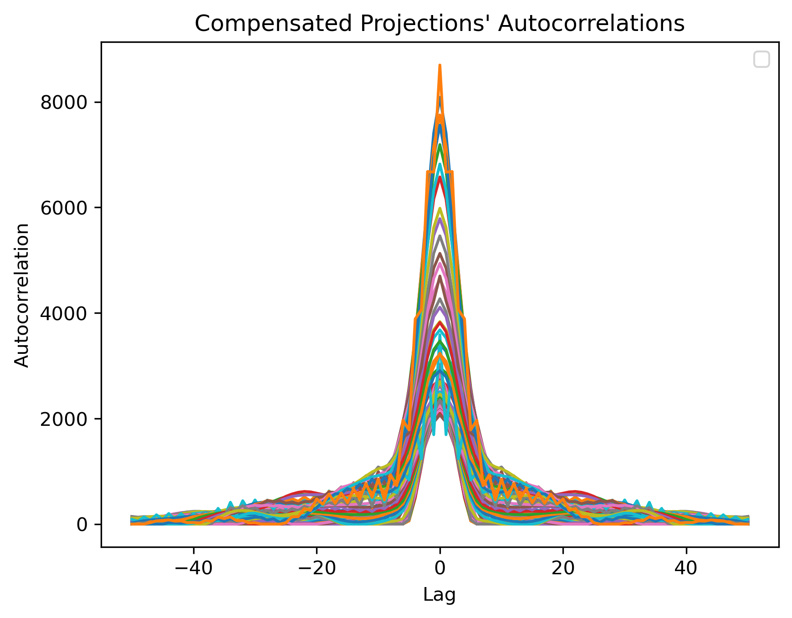
  <br><em>Gauche : autocorrélations des projections. Droite : après déconvolution du flou intrinsèque.</em>
</p>

<p align="center">
  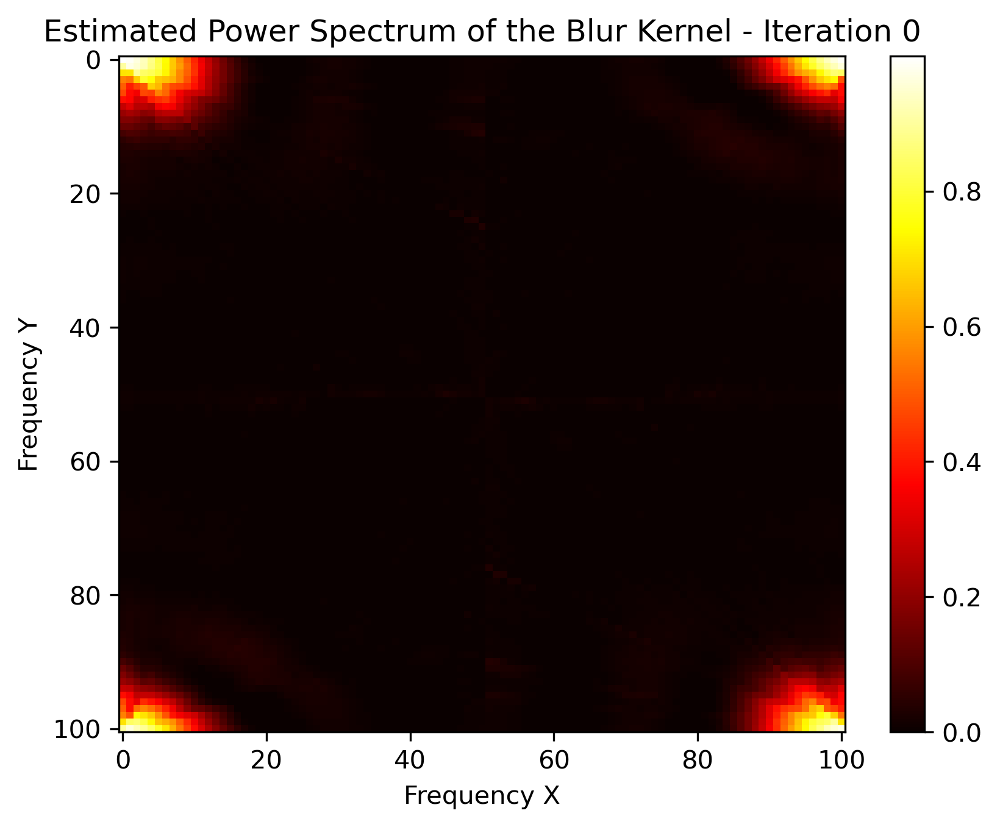
  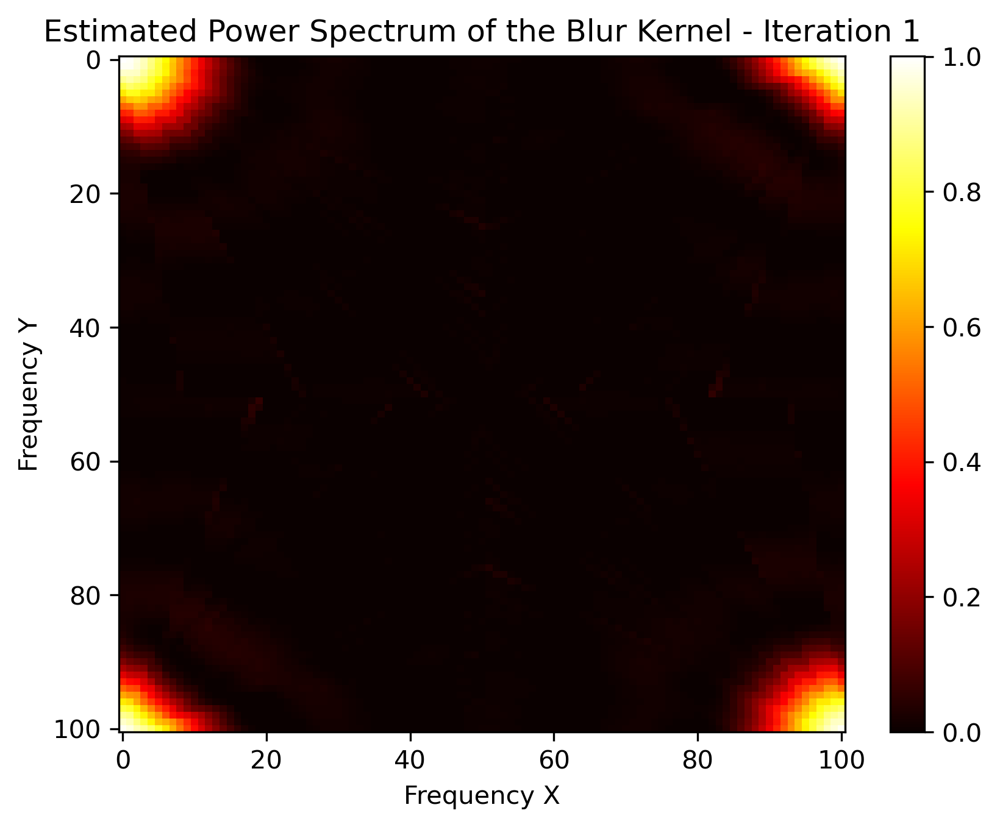
  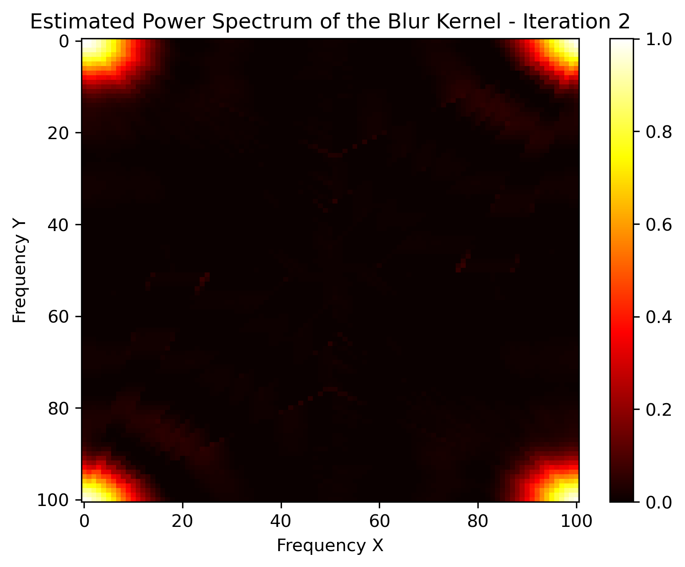
  <br><em>Spectre de puissance du noyau au fil des itérations (0, 1, 2).</em>
</p>

<p align="center">
  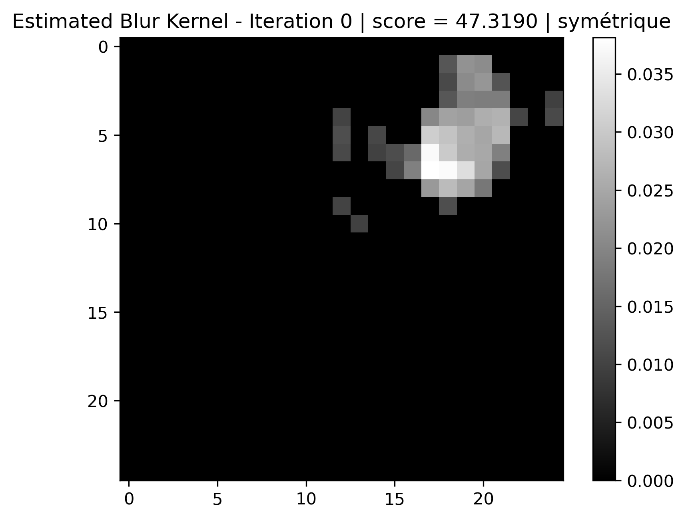
  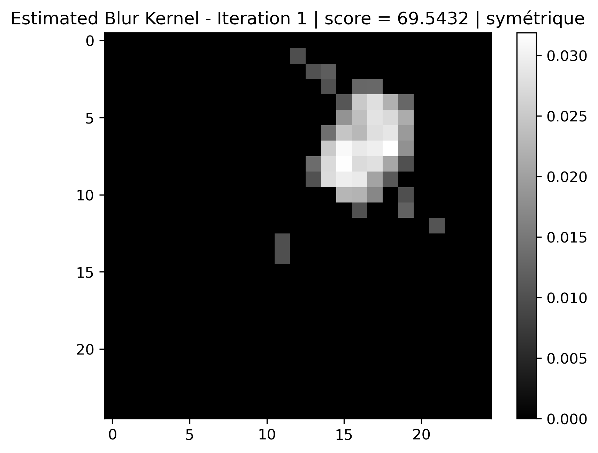
  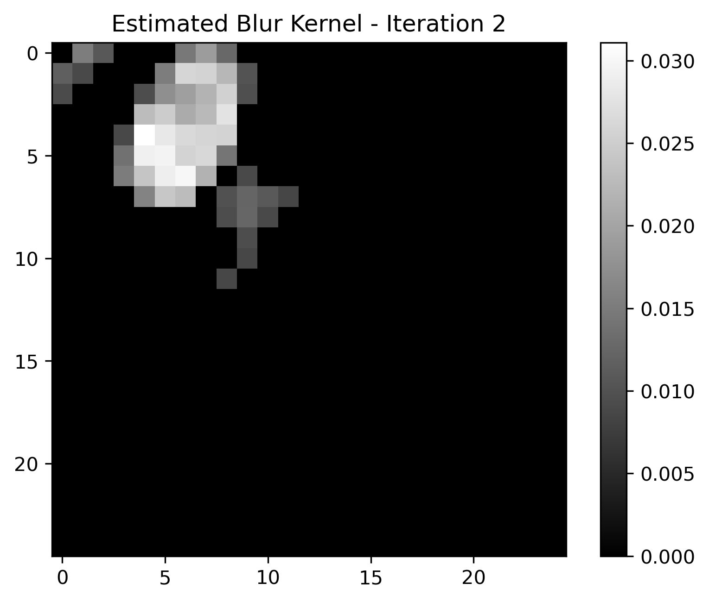
  <br><em>Noyau estimé au fil des itérations. Le noyau converge vers la forme du flou de bougé.</em>
</p>

> **Note :** Deux implémentations coexistent. `kernel_estimation_bis.py` (celle du professeur) applique la corrélation 2D sur les gradients puis projette, ce qui est légèrement différent de l'article original (`kernel_estimation.py`) qui applique blanchiment → projections → autocorrélations 1D. `kernel_estimation.py` est encore en cours de débogage.

---

### 2.2 Déconvolution TV — Split-Bregman

Une fois le noyau $h$ estimé, l'image nette est restaurée en résolvant le problème de minimisation **Total Variation**. Le solveur Split-Bregman a été **implémenté intégralement à la main**, y compris le calcul du Laplacien discret dans le domaine de Fourier, la mise à jour des variables de Bregman, et les deux variantes de conditions aux bords :

$$\min_u \frac{\lambda}{2} \|u \ast h - v\|_2^2 + \|\nabla u\|_1$$

L'algorithme **Split-Bregman** décompose ce problème en sous-problèmes analytiquement solubles, avec convergence rapide.

Deux variantes sont implémentées :
- **Conditions circulaires** (`tvdeconv.py`) : la convolution est calculée dans le domaine de Fourier avec DFT.
- **Conditions symétriques** (`tv_deconv.py`) : utilise une extension symétrique de l'image + tapering de Tukey pour réduire les artefacts de bord.

<p align="center">
  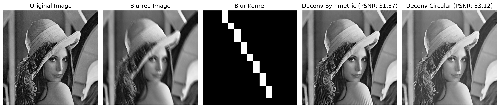
  <br><em>Comparaison des conditions aux bords : circulaires vs. symétriques (noyau exact connu).</em>
</p>

<p align="center">
  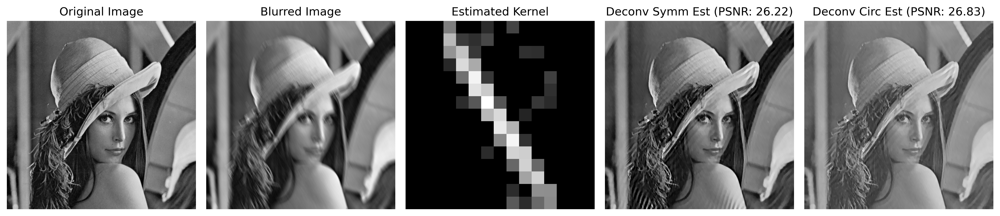
  <br><em>Même comparaison avec le noyau estimé automatiquement.</em>
</p>

---

## 3. Comparaison Deep Learning

En complément de la méthode classique, deux modèles récents de l'état de l'art ont été intégrés pour comparaison :

| Modèle | Publication | Description |
|--------|------------|-------------|
| **FFTformer** | CVPR 2023 | Transformer avec attention dans le domaine fréquentiel (FSAS) + FFN discriminatif (DFFN) |
| **EVSSM** | CVPR 2025 | Modèle d'état visuel efficace (*State Space Model*) pour le défloutage |

Ces modèles sont pré-entraînés sur les datasets **GoPro** et **RealBlur-J/R**, et appliqués directement sur les images du projet via `deep/test.py`.

---

## 4. Résultats & Illustrations

### 4.1 Robustesse au bruit

La déconvolution est testée pour différents niveaux de bruit additif gaussien (σ = 0, 1, 5, 10, 20).

<p align="center">
  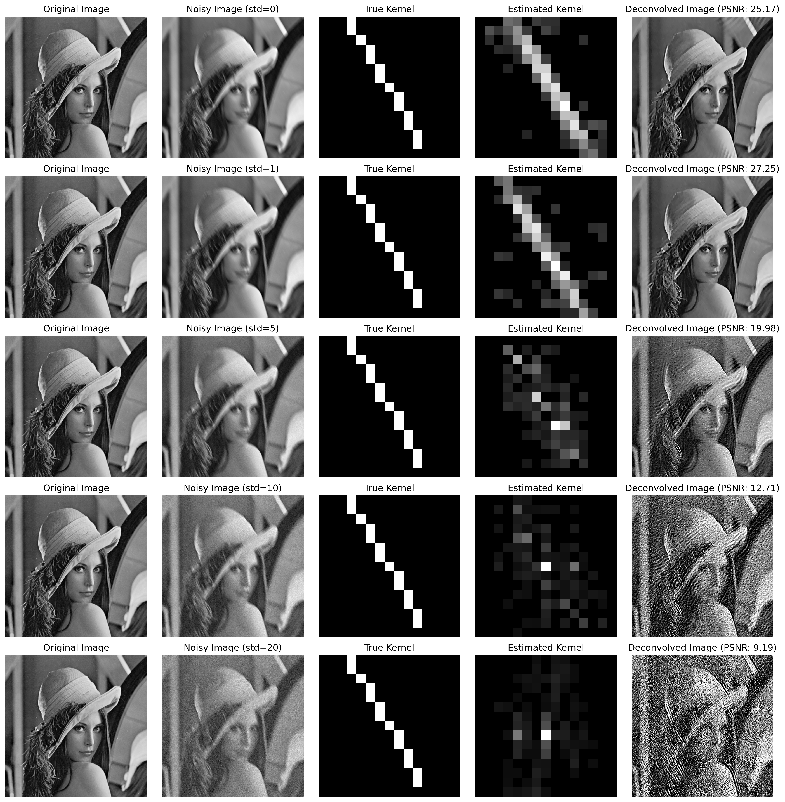
  <br><em>Robustesse au bruit : de gauche à droite, σ croissant. La PSNR est indiquée pour chaque résultat.</em>
</p>

<p align="center">
  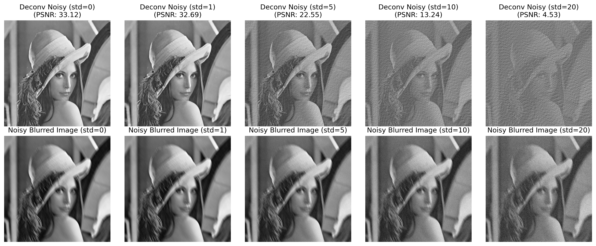
  <br><em>TV déconvolution (circulaire) sous différents niveaux de bruit.</em>
</p>

### 4.2 Sensibilité aux hyperparamètres

Les deux paramètres clés de la déconvolution TV sont $\lambda$ (fidélité aux données) et $\gamma$ (paramètre Bregman). Une recherche en grille permet d'identifier la combinaison optimale.

<p align="center">
  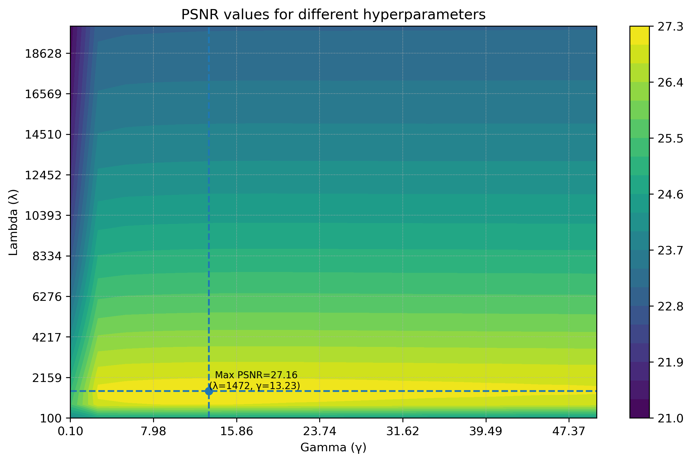
  <br><em>Carte de PSNR en fonction de λ et γ. Le maximum est marqué.</em>
</p>

<p align="center">
  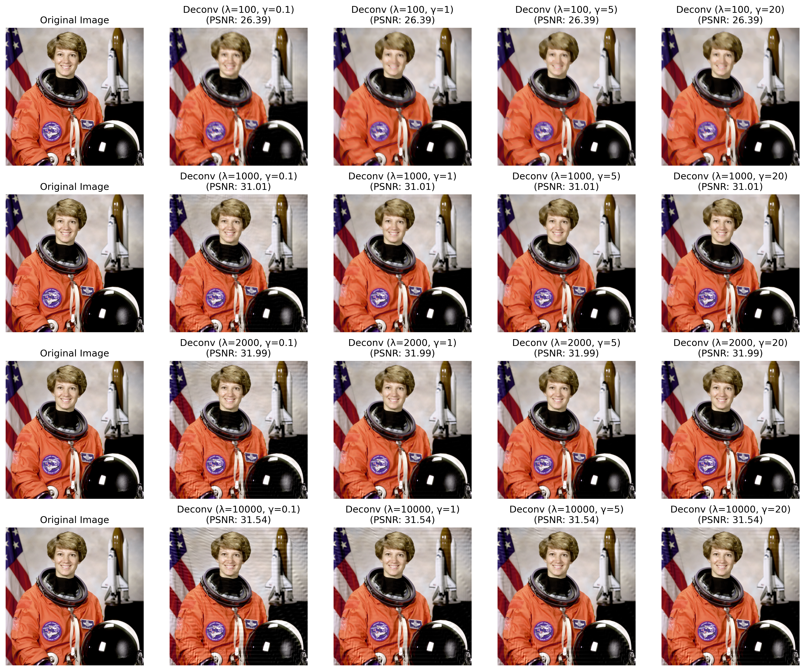
  <br><em>Résultats visuels pour différentes combinaisons (λ, γ).</em>
</p>

### 4.3 Robustesse à la taille du noyau

<p align="center">
  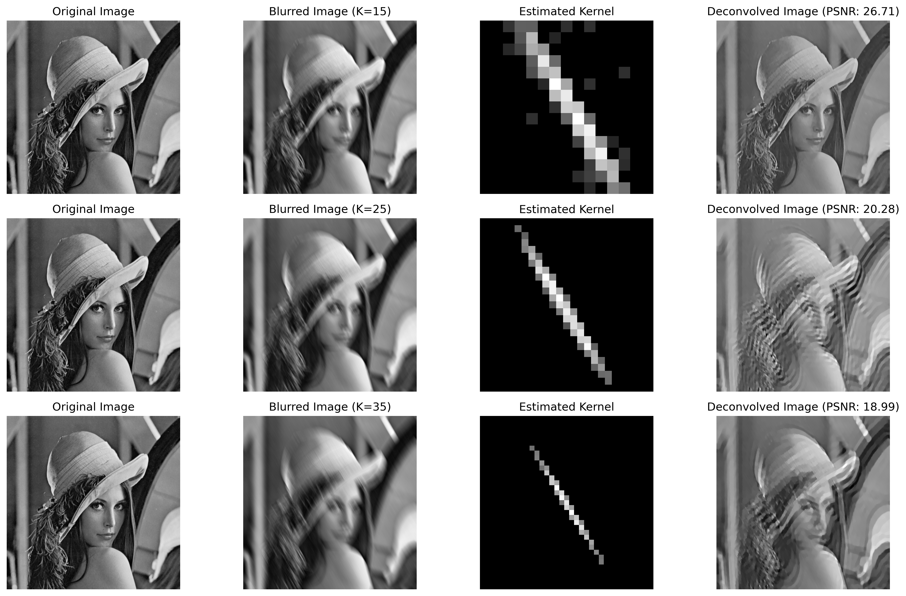
  <br><em>Pipeline complet pour des noyaux de tailles 15, 25 et 35 pixels.</em>
</p>

### 4.4 Robustesse à la compression JPEG

L'estimateur de noyau est testé sur des images compressées en JPEG à différentes qualités (PNG, 75%, 50%, 25%, 10%).

<p align="center">
  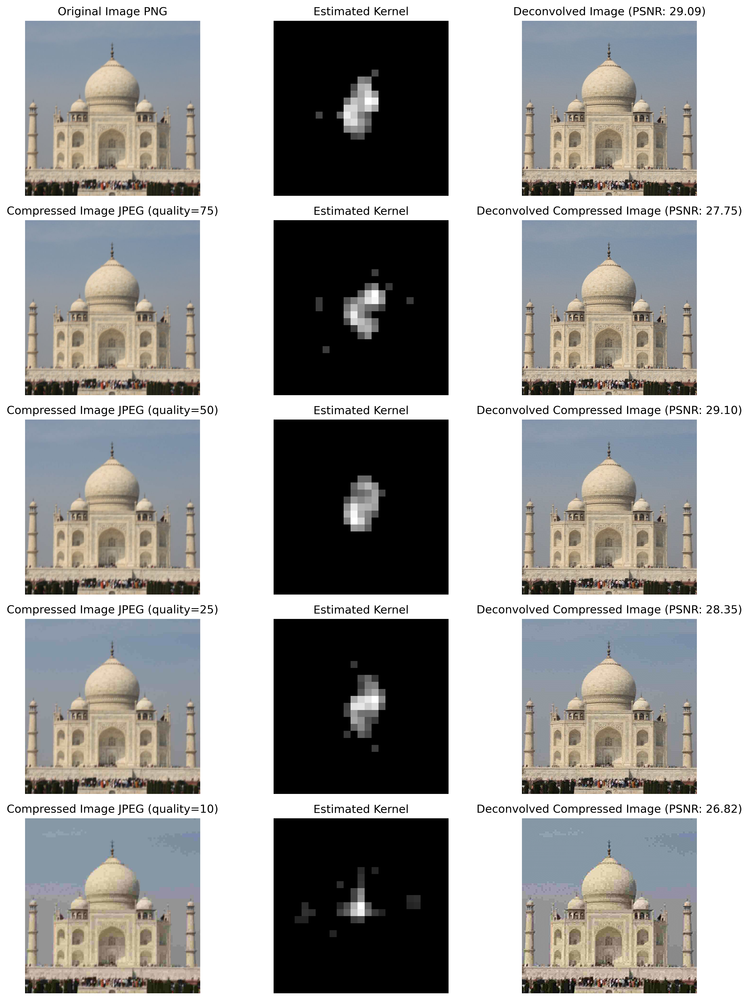
  <br><em>Effet de la compression JPEG sur la qualité d'estimation et de déconvolution.</em>
</p>

### 4.5 Images réelles

<p align="center">
  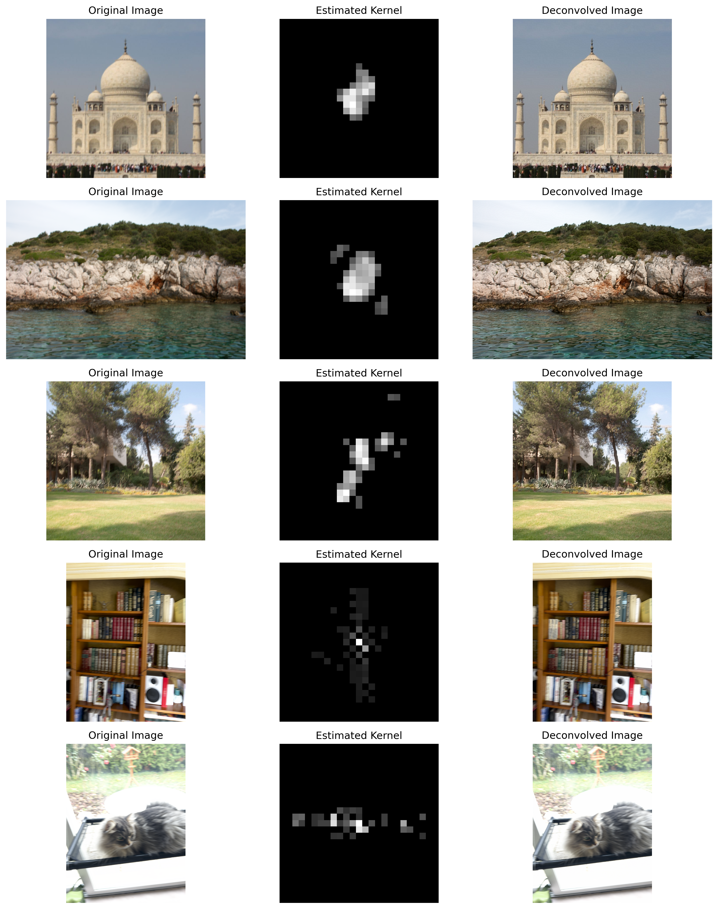
  <br><em>Application du pipeline sur des images réelles floues : image d'entrée, noyau estimé, image restaurée.</em>
</p>

---

## 5. Structure du dépôt

```
_PROJECT/
├── code_perso/                 # Implémentation Python (ce projet)
│   ├── kernel_estimation.py    # Estimation du noyau (implémentation personnelle — en cours)
│   ├── kernel_estimation_bis.py# Estimation du noyau (version du professeur)
│   ├── tv_deconv.py            # Déconvolution TV, conditions symétriques
│   ├── tvdeconv.py             # Déconvolution TV, conditions circulaires
│   ├── utils.py                # Fonctions utilitaires (métriques, chargement, ...)
│   ├── test.py                 # Tests et expériences
│   └── main.py                 # Point d'entrée CLI
│
├── code_original/              # Implémentation C++ originale (Goldstein & Fattal)
│
├── deep/                       # Modèles deep learning
│   ├── EVSSM/                  # Efficient Visual SSM (CVPR 2025)
│   ├── FFTformer/              # FFT-based Transformer (CVPR 2023)
│   ├── DeblurDiff/             # Deblurring par diffusion
│   └── test.py                 # Inférence sur une image avec EVSSM / FFTformer
│
├── data/                       # Images de test (lena, taj_mahal, arbres, ...)
├── figures/                    # Figures pour le rapport
├── results/                    # Résultats expérimentaux
├── kernel_est/                 # Résultats intermédiaires kernel_estimation.py
├── kernel_est_bis/             # Résultats intermédiaires kernel_estimation_bis.py
├── papers/                     # Rapport LaTeX + slides Beamer
└── ressources/                 # Articles de référence (PDF)
```

---

## 6. Installation & Usage

### Dépendances

```bash
pip install numpy scipy matplotlib imageio scikit-image
```

Pour les modèles deep learning :

```bash
pip install torch torchvision pillow
```

### Utilisation du pipeline classique (CLI)

```bash
python -m code_perso.main \
    -input_image data/arbres.png \
    -output_kernel kernel_est.png \
    -output_deconvolved deblurred.png
```

### Lancer les expériences

```python
# Dans code_perso/test.py
python test.py
```

Les fonctions disponibles :
- `test_circular_vs_symmetric()` — compare les deux conditions aux bords
- `test_tvdeconv_noise()` — robustesse au bruit
- `test_hyperparameters_tv_deconv()` — grille d'hyperparamètres
- `hyperparameter_tuning_graph()` — carte de PSNR (λ, γ)
- `noise_test()` — robustesse de l'estimateur au bruit
- `kernel_size_test()` — test sur différentes tailles de noyau
- `compressed_test()` — test sur images JPEG
- `realimages_test()` — test sur images réelles

### Inférence deep learning

```bash
cd deep
python test.py  # génère deblurred_evssm.png et deblurred_fftformer.png
```

---

## 7. Références

- **Goldstein & Fattal (2012)** — *Blur-Kernel Estimation from Spectral Irregularities*, ECCV 2012. [`ressources/article_lr.pdf`](ressources/article_lr.pdf)
- **Goldstein & Fattal** — TV Deconvolution IPOL. [`ressources/deconTV_IPOL.pdf`](ressources/deconTV_IPOL.pdf)
- **Goldstein & Osher (2009)** — *The Split Bregman Method for L1-Regularized Problems*. [`ressources/Split_bregman.pdf`](ressources/Split_bregman.pdf)
- **Krishnan & Fergus (2009)** — *Fast Image Deconvolution using Hyper-Laplacian Priors*, NeurIPS. [`ressources/fast-image-deconvolution-using-hyper-laplacian-priors-4h5488ty79.pdf`](ressources/fast-image-deconvolution-using-hyper-laplacian-priors-4h5488ty79.pdf)
- **Kong et al. (2023)** — *Efficient Frequency Domain-based Transformers for High-Quality Image Deblurring*, CVPR 2023. (FFTformer)
- **Kong et al. (2025)** — *Efficient Visual State Space Model for Image Deblurring*, CVPR 2025. (EVSSM)

---

## Pistes d'amélioration

- [ ] Finaliser le débogage de `kernel_estimation.py` (version personnelle)
- [ ] Implémenter la régularisation hyper-laplacienne pour la déconvolution
- [ ] Améliorer le modèle de décroissance en loi de puissance et le pré-débruitage avant le calcul des autocorrélations
- [ ] Implémenter un meilleur algorithme de compensation
